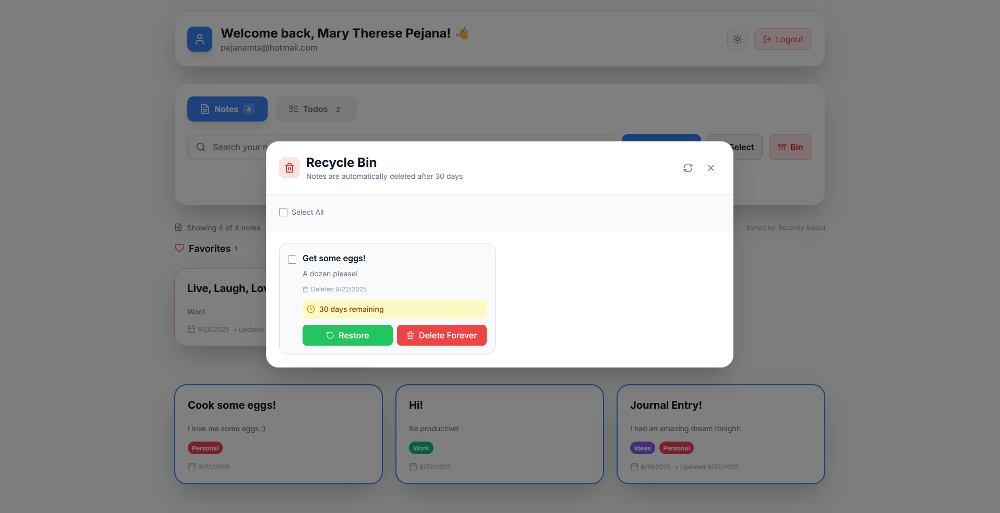

# 📝 Batibot Notes App

A full-stack notes application with Google authentication, built using React (frontend) and Node.js/Express with PostgreSQL (backend).

---

## ✨ Features

- 🔐 **Google OAuth User Authentication**
- 📄 **Create, edit, delete, and search notes**
- 📱 **Minimalist UI and Responsive design**
- 🗄️ **PostgreSQL database for storage**

---

## 📸 App Previews

### 🔐 Login Screen
<div align="center">
  
</div>

*Clean and simple Google OAuth login interface*

### 🌙 Dark Mode Toggle
<div align="center">
  
</div>

*Seamless switching between light and dark themes*

### 💾 Note Saving
<div align="center">
  
</div>

*Real-time note creation and saving functionality*

### 📋 Note Selection
<div align="center">
  
</div>

*Easy navigation and selection between your notes*

### 🗑️ Trash/Bin Feature
<div align="center">
  
</div>

*Manage deleted notes with the built-in trash system*

### ✅ Todo Management
<div align="center">
  
</div>

*Organize your tasks with the integrated todo functionality*

---

## 🛠️ Technologies Used

### 🎨 Frontend
- ⚛️ React (TypeScript)
- ⚡ Vite (build tool)
- 🎨 Tailwind CSS (styling)
- 🔄 Context API (auth state)
- 🧩 Custom components for notes, modals, authentication, dashboard

### 🔧 Backend
- 📦 Node.js + Express
- 📘 TypeScript
- 🛡️ Passport.js (Google OAuth)
- 🐘 PostgreSQL (database)
- 🔗 pg (PostgreSQL client)
- 🎫 JWT (session management)

---

## 🚀 Getting Started

### 📋 Prerequisites
- 📦 Node.js & npm
- 🐘 PostgreSQL

---

## ⚙️ Backend Setup

1. **📥 Install dependencies:**
	```bash
	cd backend
	npm install
	```

2. **🔧 Configure environment variables:**
	- Edit `.env` in `backend/` with your database and Google OAuth credentials.

3. **🗄️ Create the database:**
	- Open `psql` and run:
	  ```
	  CREATE DATABASE "BatibotApp";
	  ```

4. **🚀 Run the backend server:**
	```bash
	npm run dev
	```
	- Server runs on port specified in `.env` (default: 5000).

### 🎨 Frontend Setup

--- 

1. **📥 Install dependencies:**
	```bash
	cd frontend
	npm install
	```

2. **🚀 Run the frontend:**
	```bash
	npm run dev
	```
	- App runs on [http://localhost:5173](http://localhost:5173) by default.

---

## 📁 Folder Structure

---

### 🔧 Backend (`/backend`)
- `src/server.ts` — Entry point
- `src/config/` — Auth and database config
- `src/controllers/` — Auth and notes logic
- `src/middleware/` — Auth middleware
- `src/models/` — User and Note models
- `src/routes/` — API routes

### 🎨 Frontend (`/frontend`)
- `src/App.tsx` — Main app component
- `src/components/` — UI components (Dashboard, Note, Modals, Auth, etc.)
- `src/contexts/` — Auth context
- `src/styles/` — Global styles
- `src/utils/` — API utilities

---

## 🔐 Environment Variables

---

Backend `.env` example:
```
PORT=5000
DB_USER=postgres
DB_PASSWORD=yourpassword
DB_HOST=localhost
DB_PORT=5432
DB_NAME=BatibotApp
JWT_SECRET=your_jwt_secret
SESSION_SECRET=your_session_secret
GOOGLE_CLIENT_ID=your_google_client_id
GOOGLE_CLIENT_SECRET=your_google_client_secret
```

---

## 👥 Contributors

Thanks to all the amazing contributors who made this project possible:

<div align="center">
  <table>
    <tr>
      <td align="center">
        <a href="https://github.com/alkaseltzerrr">
          
          <br />
          <sub><b>Mary Therese Pejana</b></sub>
        </a>
      </td>
      <td align="center">
        <a href="https://github.com/Lraccc">
          
          <br />
          <sub><b>Carl Janssen Tampus</b></sub>
        </a>
      </td>
      <td align="center">
        <a href="https://github.com/Cappi-dev">
          
          <br />
          <sub><b>Jes Emanuel Chavez</b></sub>
        </a>
      </td>
    </tr>
    <tr>
      <td align="center">
        <a href="https://github.com/KikayKyla123">
          
          <br />
          <sub><b>Kyla Dominic Genodiala</b></sub>
        </a>
      </td>
      <td align="center">
        <a href="https://github.com/istroberiless">
          
          <br />
          <sub><b>Kyle Niña Inion</b></sub>
        </a>
      </td>
      <td align="center">
        <a href="https://github.com/Penguinmans32">
          
          <br />
          <sub><b>vanpenguin</b></sub>
        </a>
      </td>
    </tr>
  </table>
</div>

<br>

<div align="center">
	<b>Made with ❤️ by the Batibot Team! :3</b>
</div>